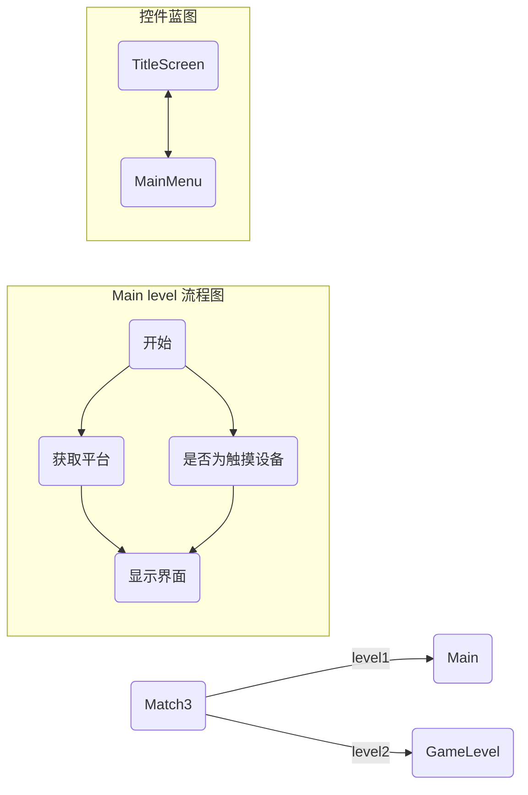
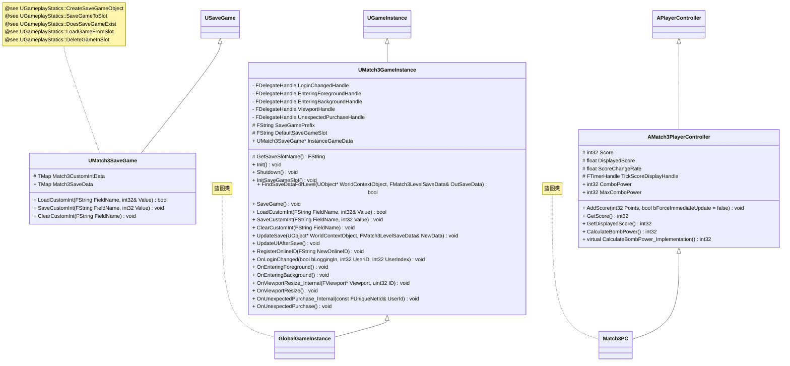

# match3 项目的流程图

#### 流程图的意思

#### 类图的意思
继承 <|--
依赖 <..
关联 <--
聚合 o..
组合 \*--\*

## 蓝图方法

Get Platform Name: 获取平台名字
  - Windows
  - iOS
  - Android

## widget 控件

每个控件蓝图，有个属性 details , 在 Graph 页签里。
其中可以选择背景图

## 